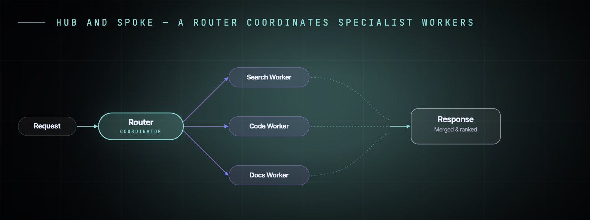
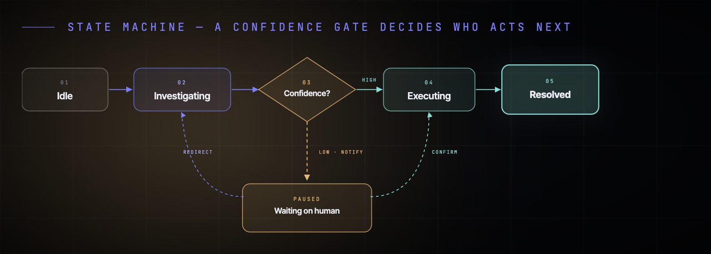
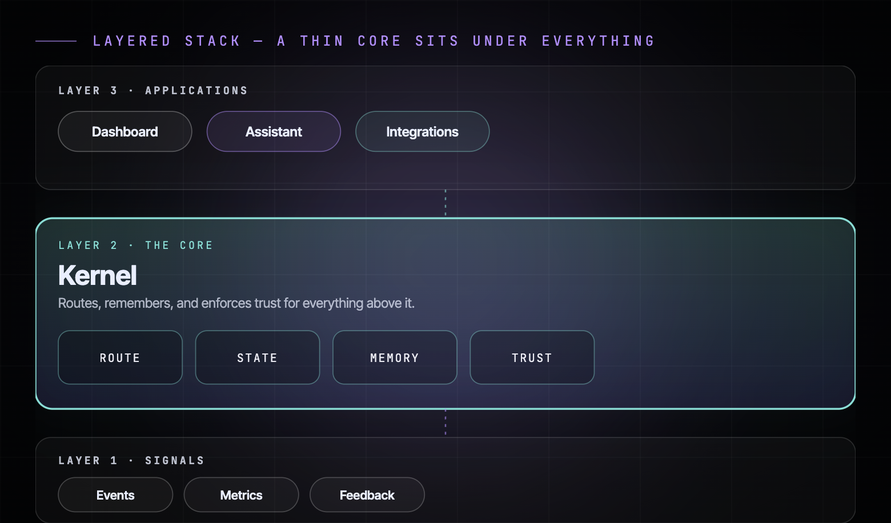

<div align="center">

[中文](./README.zh.md) · **English**

# 🌌 Linear Style Illustration

**Dark, glowing "AI-OS" system diagrams — cyan × purple × lilac duotone, pill-shaped SVG nodes, one glowing kernel per diagram.**

[](./LICENSE)
[]()
[](./examples)
[](https://github.com/yanliudesign/linear-style-illustration/stargazers)

[](https://claude.ai/code)
[]()
[]()
[]()
[]()

</div>

A design-taste skill that turns any system/flow/architecture idea into a **dark, technical "AI operating system" diagram** — the kind of diagram you'd see in a Linear keynote, an AI-agent product deck, or a technical landing page. Signature move: a **near-black stage**, **soft blurred color orbs** behind the content, **pill-shaped nodes** with thin colored strokes, and **exactly one glowing "kernel" node** per diagram to show where the center of gravity is.

Not a generic diagramming tool. Not Mermaid, not a whiteboard export. This is the disciplined, opinionated dark-tech look — output as a self-contained HTML file with inline SVG, ready to drop into a slide deck or export as a PNG.

<p align="center">
  
  <br><sub><b>Hub and spoke</b> — a router coordinates specialist workers</sub>
</p>
<p align="center">
  
  <br><sub><b>State machine</b> — a confidence gate decides who acts next</sub>
</p>
<p align="center">
  
  <br><sub><b>Layered stack</b> — a thin core sits under everything</sub>
</p>

## What's inside

| File | Purpose |
|---|---|
| [`SKILL.md`](./SKILL.md) | Skill entry point — Claude reads this to decide when / how to trigger, and which archetype fits |
| [`references/style-tokens.md`](./references/style-tokens.md) | Copy-paste CSS/HTML/SVG: fonts, `:root` color vars, background system (grid/orb/vignette), text components, arrow marker defs, node fill/stroke recipes |
| [`references/patterns.md`](./references/patterns.md) | 7 diagram archetypes — pill-chain, hub-and-spoke, layered stack, fan-in funnel, state machine, flywheel/cycle, numbered waterfall — as adaptable SVG/HTML blocks |
| [`examples/`](./examples/) | 3 rendered example diagrams with their source HTML |

## Three rules the skill lives by

1. **Near-black background, always.** `--stage-bg: #06070a`. No white cards, no light mode. Depth comes from a faint grid, a blurred color orb, and a vignette — never from drop shadows on every node.
2. **Color is a role, not a decoration.** Cyan = primary flow / success / AI output. Purple = secondary / human / decision. Lilac = tertiary / organizational. Warn-orange = gates, pauses, human-in-the-loop. Never assign a color at random, and never use more than 2–3 in one diagram.
3. **Pills, not boxes — and one glow, not seven.** Nodes are rounded (`rx` = half-height for pill endpoints, `rx 12–18` for cards) with low-opacity fill and a thin stroke. Exactly one "kernel" node per diagram gets the glow (drop-shadow filter + solid stroke). Max 6–7 nodes — split into two diagrams if you need more.

## Install

Drop into your Claude Code skills folder:

```bash
git clone https://github.com/yanliudesign/linear-style-illustration.git \
  ~/.claude/skills/linear-style-illustration
```

Restart Claude Code. Trigger phrases live at the top of [`SKILL.md`](./SKILL.md).

## Trigger phrases

| You say | It runs |
|---|---|
| *"Give me a Linear-style diagram"* / *"Linear 风格的 diagram"* | this skill |
| *"Dark tech / AI-OS architecture diagram"* | this skill |
| *"Hub-and-spoke diagram"* / *"a router coordinates workers"* | this skill |
| *"State machine diagram with a confidence gate"* | this skill |
| *"Layered architecture diagram, kernel in the middle"* | this skill |
| *"深色科技图"* / *"暗色架构图"* | this skill |

## Good for

- **AI/agent product decks** — architecture slides, "how it works" diagrams, coordinator/worker patterns
- **Technical landing pages** — dark-mode product/feature diagrams, "under the hood" sections
- **Conference talks** — system diagrams, state machines, flywheels for technical presentations
- **Dev blog posts / docs** — architecture diagrams that need to look sharp on a dark background

## Not for

- **Light-mode / print documents** — this palette depends on a near-black background to work
- **Data visualization** (charts, graphs with real numeric axes) — this is a system/flow diagram style, not a charting library
- **Whimsical/hand-drawn illustrations** — opposite aesthetic; this is precise, technical, cold
- **Org charts / dense enterprise diagrams** with 15+ nodes — this style caps out around 6–7 nodes per diagram

## Delivery format

One turn gives you a self-contained `.html` file (inline SVG, 1600–1920px canvas) using the boilerplate in `references/style-tokens.md` and the closest archetype in `references/patterns.md` — ready to open in a browser, embed in a slide deck, or screenshot to PNG.

## License

MIT — see [LICENSE](./LICENSE).
